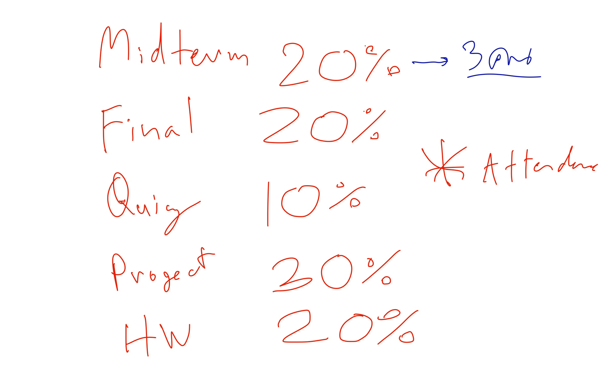

# BasicProg_DataViz65
รวบรวมงานวิชา SC663401 : Basic Programmimg for Data Science and Data Visualization ของ ณัฐนิช หิรัญชวโรจน์ ID6330205528

# Grading


# สมาชิกในกลุ่ม
## กลุ่ม Midterm ชื่อ หวัดดีเบล
1. นายนราวิชญ์ ประทานทรัพย์ 633020445-9
2. นางสาวภรณกนก ภูผาธรรม 633020446-7
3. นางสาวณัฐนิช หิรัญชวโรจน์ 633020552-8

## กลุ่ม Project ชื่อ หยกนัทหยกนัทหยกนัทหยก
1. นางสาวภรณกนก ภูผาธรรม 633020446-7
2. นางสาวณัฐนิช หิรัญชวโรจน์ 633020552-8

## กลุ่ม Final ชื่อ หมีเรื่องแล้ว
1. นายธนภัทร โสภณ 633020444-1
2. นางสาวณัฐนิช หิรัญชวโรจน์ 633020552-8
3. นายเฉลิมเกียรติ คำชะนาม 633021013-3

# Chapter1:[Functions, print, Loop, if ](https://github.com/natthanich/BasicProg_DataViz65/blob/main/Basic_Programming_Concepts.ipynb):point_left:	
## Functions ($f(x) = y$) :dog:
def function_name(input_x):
    # do something with input_x to get output_y
    return output_y
    
function มีส่วนสำคัญทั้งหมด 4 ส่วน
1. บอก python ว่าเราจะเขียนฟังก์ชั่น ชื่ออะไร  `def function_name()`: (ขาดไม่ได้)
2. กำหนดตัวแปรที่จะเป็น input  _Input_ (ขาดได้)
3. ส่วนประมวลผล do_something with _Input_ to get _Output_ (ขาดไม่ได้)
4. ส่วน output `return` _Output_(ขาดได้)

ex. :upside_down_face:
```javascript
defi function_f1(x): 
    a = x**2  
    y = a + 75  
    return y; 
```

## `print` :cat:
ตัวอย่าง function `print` https://www.programiz.com/python-programming/methods/built-in/print


print()  ใส่ input ได้หลายตัว
-   ** คือ จำเป็นต้องใส่
- = คือ ไม่จำเป็นต้องใส่ มีค่าตั้งต้นมาให้
- end คือ จบบรรทัด  \n คือด้วยการขึ้นบรรทัดใหม่
- sep คือ เว้นวรรคค่าด้วย ' ' คือ ช่องว่าง

## Looping (for):tiger:
สำหรับทำงายเยอะๆ ซ้ำๆ
```python
for member in listEx:       ## วนที่สมาชิก ใน list
    do_something()
```
for ชื่อตัวแปร in list ที่จะเอามาใช้เป็นสมาชิกใน ตัวแปร:     
    
วนซ้ำ
- วนซ้ำสมาชิกใน 
### ใช้ for loop เพิ่มสมาชิกใน list :pig:
```
list_name = [] #นิยมสร้าง list เปล่าๆก่อน
list_id = []
list_grade = []
for each in list_name_id_grade:
    list_name.append(each[0])
    list_id.append(each[1])
    list_grade.append(each[2])
```
#### Loop ซ้อน Loop (nested loop):cow:
```
#แม่สูตรคูณ
for mem1 in range(2,5): #แม่[2,3,4]
    print(f'now mem1 = {mem1}')
    for mem2 in range(1,13): #[1,2,3,4,5,6,7,8,9,10,11,12]ตัวมาคูณ
        print(f'{mem1} x {mem2} = {mem1*mem2}')
    print(f'end inner for mem1 = {mem1}') #จบในลูป
```
#### Loop in Function :unicorn:
```
def print_grade_loop(names,grades): # names,grades มีหลายสมาชิก เป็นlist
    for n,g in zip(names,grades): # The zip() function returns a zip object, which is an iterator of tuples where the first item in each passed iterator is paired together, and then the second item in each passed iterator are paired together etc.
        print(f'{n} ได้เกรด {g}')  #  zip การจับคู่ ของเเต่ละ list ในตำแหน่เดียวกัน // จับ 2 list มาร่วมกัน
```
## Conditional Statement (if) :rabbit2:
```
if condition1:
    do_something() ## ถ้า condition1 เป็นจริง ทำ do_something()
elif condition2:
    do_another_thing()  ## ถ้า condition1 ไม่เป็นจริงแต่ condition2 เป็นจริง ทำ do_another_thing()
else:
    do_the_last_thing() ## ถ้าไม่มี condition ไหนเป็นจริงเลย ทำ do_the_last_thing()
```
#### operator ที่ใช้ตรวจสอบ condition :polar_bear:
== (เท่ากับ) , != (ไม่เท่ากับ), >=, <=, <, >, and, or
- ผลลัพธ์มีแค่ Ture flase

# Chapter2:[Data Structure (โครงสร้างข้อมูล)](https://github.com/natthanich/BasicProg_DataViz65/blob/main/Data_Structure.ipynb) :skull:
##  ```list()``` :alien:
- เอาข้อมูลมาต่อๆ กัน
- เก็บอะไรก็ได้ (ไม่จำเป็นต้องชนิดเดียวกัน)
- ลำดับในการเก็บ มีความสำคัญ

### Indexing การชี้สมาชิกใน list ด้วย เลขลำดับของ list :robot:
index = ตัวชี้
```
list_a[3] #เลือกสมาชิกลำดับที่ 3 ของ list_a
```
```
list_b[3][4] #เลือกสมาชิกลำดับที่ 4 ในสมาชิกลำดับที่ 3 ของ list_b
```
```
list_a[-1] #index -1 คือเลือกตัวสุดท้ายของ list (ลำดับ) วัตถุประสงค์การใช้ 1. listมีขนาดใหญ่ 2. list มีการเปลี่ยนแปลง
```
```
list_a[-4] # นับจากท้ายมา 4 ตัว
```
### การสร้าง `list` :panda_face:
```
list_x1 = [] #แบบที่ 1
list_x2 = list() #แบบที่ 2
```
### เพิ่มสมาชิกเข้าไปใน list ด้วย `append()`:otter:
```
list_x1.append(2) # เพิ่ม 2 เข้าไปใน list
```
### ลบสมาชิกจาก list    /// .pop() :bear:
```
list_x1.pop() #ลบออกจากท้ายสุด ||  ไม่นิยมเพราะอาจผิดพลาดได้
```
### `len()` ตรวจสอบจำนวนสมาชิกของ list 	:hedgehog:
### String is a list of characters  (ข้อความคือ ilst ของตัวอักษร) :bat:
```
st_stat = 'Department of Statistics, Faculty of Science'
st_stat[10] # เรียกดูสมาชิกตัวที่ 10
len(st_stat) # จำนวน
```
### List Slicing `:` :chicken:

สามารถเลือกสมาชิก ออกมาแสดงได้หลายๆ ตัว
> `list [จุดเริ่มต้น(ทึบ):จุดสุดท้าย(โปร่ง)]` ## เอาตัวเริ่มต้น ไม่เอาตัวสุดท้าย

> `list [จุดเริ่มต้น(ทึบ:จุดสุดท้าย(โปร่ง):step]`  # step คือ ข้ามไปกี่ตัว


#### `:` colon :penguin:
```
list_a[-3:]  # : colon  อันนี้คือ เริ่มตั้งเเต่ -3 ไปจนถึงตัวสุดท้าย
list_a[:4]  # : colon # เริ่มตั้งเเต่ตัวที่ 0 จนถึง ก่อน 4
list_a[1:4] #เริ่มตัวที่ 1 จบ ตัวที่ 3
list_a[:] #เอาทุกตัว
```
#### step  ( เพิ่มครั้งละ...) :flamingo:
```
list_c[:10:] #ดู 10 ตัวแรก นับจาก 0
--> [1, 2, 3, 4, 5, 6, 7, 8, 9, 10]
```
```
list_c[:10:2] #กรณี step = 2   เริ่มจากตัวที่ 0 เว้นระยะห่างครั้งละ 2 จนถึงก่อน 10
--> [1, 3, 5, 7, 9]
```
```
list_c[::-1] #เอาทุกตัว แต่เริ่มจากด้านหลัง
--> [13, 12, 11, 10, 9, 8, 7, 6, 5, 4, 3, 2, 1]
```
### `range()`  สร้าง list ตั้งแต่ นี่ ถึง นี่ :dove:
ได้ลำดับเลขโดยที่ไม่ต้องพิมพ์
- `range(จุดเริ่ม(ทึบ),จุดจบ(โปร่ง))`
```
range(21) #ต้องการ 21 ตัว
range(0, 21)
a = list(range(21))
a
--> [0, 1, 2, 3, 4, 5, 6, 7, 8, 9, 10, 11, 12, 13, 14, 15, 16, 17, 18, 19, 20]
list(range(1,21))
--> [1, 2, 3, 4, 5, 6, 7, 8, 9, 10, 11, 12, 13, 14, 15, 16, 17, 18, 19, 20]
```
## Dictionary :face_in_clouds:
- คล้าย lits() (เก็บอะไรก็ได้)
- index เป็นอะไรก็ได้ ไม่จำเป็นต้องเป็นตัวเลขลำดับ (ตัวชี้)
- ลำดับไม่มีความสำคัญ
- ยืดหยุ่นกว่า list เพราะเอาอะไรเป็น index ก็ได้
### สร้าง Dictionary :frog:
dict_a = {1:'Happy','N': 'New','2022':'Year'} #{} curly brackets //ก็คือ index ที่ชี้happyคือ 1 ถ้าพิมพ์ 1 ลงไปจะเเสดงhappy
### การชี้สมาชิกใน Dictionary
```
dict_a[1]
--> 'Happy'
```
```
dict_a['N']
--> 'New'
```
```
dict_a.keys() #ดูว่าใน dict มี key = index อะไรบ้าง
dict_a.values() # เรียกดูว่ามีค่าอะไรในdict บ้าง
```
### การเพิ่มสมาชิกลงไปใน Dictionary :dragon_face:
dict_a[ ที่มีindexเป็น] =  จะมีค่า่เท่ากับ
```
dict_a[7] = 3.14
dict_a
--> {1: 'Happy', 'N': 'New', '2022': 'Year', 7: 3.14}
```
```
dict_a['N'] = 'NNNNEEEEWWWW' #มันจะไปอัปเดตอันเก่าให้เป็นตัวที่เราตั้งใหม่
dict_a
--> {1: 'Happy', 'N': 'NNNNEEEEWWWW', '2022': 'Year', 7: 3.14}
```
## Numpy Array :whale:
เป็นdata structure อย่างหนึ่ง ที่เก็บข้อมูลได้หลายมิติ
- เก็บได้แค่ตัวเลข
- อ้างอิงโดยใช้ พิกัด (2 มิติ ก็มองเป็น matrix)
- มิติมีความสำคัญ ข้อมุลมากขึ้น มิติก็มากขึ้น

### 1D array (n,) :octopus:
```
import numpy #import package ของคนอื่นมา
list_A = [1,2,3,4,5]
arr_a = numpy.array(list_A) #แปลงจาก listไปเป็น array  /// เหมือน arr_a = numpy.array([1,2,3,4,5])
arr_a
--> array([1, 2, 3, 4, 5])
arr_a[0] #เรียกดูสมาชิกแต่ละตัวเหมือน list
--> 1
```
### Matrix (Scalar multiplication) array มีคุณสมบัติเหมือน matrix :shell:
```
5 * arr_a
--> array([ 5, 10, 15, 20, 25])
```
```
5 * list_A #ซ้ำกัน 5 รอบ
--> [1, 2, 3, 4, 5, 1, 2, 3, 4, 5, 1, 2, 3, 4, 5, 1, 2, 3, 4, 5, 1, 2, 3, 4, 5]
```
```
arr_b = numpy.array([10,20,30,40,50])
arr_a + arr_b #ตัวที่อยู่ตำแหน่งเดียวกันมาบวกกัน
--> array([11, 22, 33, 44, 55])
```
### 2D array :thinking:
 array 2 มิติ
 ```
import numpy as np  #   เรียก numpy มาใช้ แต่เปลี่ยนชื่อเป็น np
arr2_z = np.array([[1,2,3],[4,5,6]]) # สมาชิกลำดับที่ 1 เป็นแถว ลำดับที่ 2 เป็นหลัก
arr2_z
--> array([[1, 2, 3],
          [4, 5, 6]])
arr2_z.shape #ดูว่ามีกี่แถวกี่หลัก อันนี้คือมี 2 แถว 3 หลัก
--> (2, 3)
```
### `np.zeros()` :shushing_face:
สร้าง array ว่างๆ ขึ้นมา
```
arr2_3_5_0 = np.zeros((3,5)) #สร้าง array ที่ตั้งต้นด้วย 0 แบบ 3 แถว 5 หลัก ค่อยเพิ่มค่าทีหลังได้
arr2_3_5_0 #เราต้องกำหนดขนาดของ array ขยายไม่ได้
--> array([[0., 0., 0., 0., 0.],
           [0., 0., 0., 0., 0.],
           [0., 0., 0., 0., 0.]])
 ```
 ```
 arr2_3_5_0[1,2] = 9 #กำหนดค่าแถวที่ 1 หลักที่ 2 ให้เป็นเลข 9
 arr2_3_5_0
 --> array([[0., 0., 0., 0., 0.],
            [0., 0., 9., 0., 0.],
            [0., 0., 0., 0., 0.]])
```
```
arr2_3_5_0[1,2] #ชี้
--> 9.0
```
```
#เปลี่ยนค่าใน list() :seal:
print(list_A) # เรียกดู list ก่อน
list_A[-1] = 'Christmas' #เปลี่ยนค่าใน list()
print(list_A)
-->  [1, 2, 3, 4, 5]
     [1, 2, 3, 4, 'Christmas']
```
### `np.ones()`:woozy_face:
- เริ่มต้นมาค่าเป็น 1 หมด
- ทำให้สามารถกำหนดค่าเริ่มต้นเป็นค่าอื่นๆ ได้
```
arr_2_4_5_1 = np.ones((4,5))  # 4 แถว 5หลัก
--> array([[1., 1., 1., 1., 1.],
           [1., 1., 1., 1., 1.],
           [1., 1., 1., 1., 1.],
           [1., 1., 1., 1., 1.]])
```
```
arr_2_4_5_200 = 200 * np.ones((4,5))
--> array([[200., 200., 200., 200., 200.],
           [200., 200., 200., 200., 200.],
           [200., 200., 200., 200., 200.],
           [200., 200., 200., 200., 200.]])
```
### Matrix operations	:monocle_face:
-  การบวก ลบ matrix $M ± N$ บวกลบตัวที่อยู่ตำแหน่งเดียวกัน และ matrix shape ต้องเท่ากัน
- การคูณ matrix
  - Scalar คูณ Matrix   $aM$ (คูณกระจายเข้าไปทุกตัว)
  - Matrix คูณ Matrix   $M\times N$ (แถวคูณหลัก)
    - $M×N$ (dot product)
    - (m,n) × (n,o) = (m,o) (Shape)
    -  ตัวหน้า ตัวหลังมีความสำคัญ
    
    ```
    mat_a = np.array([[2,3,5],[4,6,7]])
    mat_b = np.array([[1,2,5],[2,4,-7]])
    mat_c = np.array([[2,3],[4,6],[7,9]])
    ```
    ```
    np.dot(mat_a,mat_c)
    --> array([[ 51,  69],
               [ 81, 111]])
    ```
    ```
    np.dot(mat_c,mat_a)
    --> array([[16, 24, 31],
               [32, 48, 62],
               [50, 75, 98]])
    ```
    ```
    mat_a * mat_b #คูณตัวตำแหน่งเดียวกัน ไม่เป็นไปตามสมบัติ matrix
    --> array([[  2,   6,  25],
               [  8,  24, -49]])
### Matrix Slicing :muscle:
```
mat_X = np.dot(mat_c,mat_b)
print(mat_X)
--> [[  8  16 -11]
     [ 16  32 -22]
     [ 25  50 -28]]
mat_X[:2,:2]  #เลือกตั้งแต่แถวที่ 0- ก่อน 2 , เลือก หลักที่ 0-ก่อน2
--> array([[ 8, 16],
           [16, 32]])
```           

  

  


